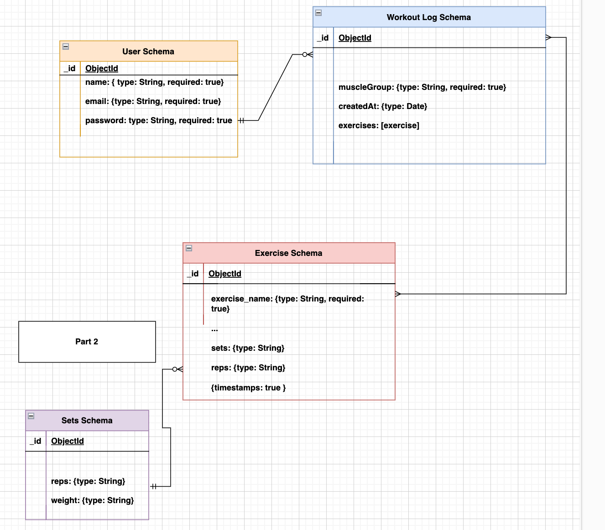

# Workout Tracker App

## Introduction

 A MERN stack workout tracker app made for fitness enthusiasts to plan and track their workouts.

 

## Resources
- [Mongoose Documentation](https://mongoosejs.com/docs/) 
- [YouTube Tutorial](https://www.youtube.com/watch?v=I7EDAR2GRVo&list=PLhwvZuAVtz8Ftb0AphUjvDG30_PQbIHd3&index=1&t=2436s&pp=gAQBiAQB) 
- [YouTube Tutorial](https://www.youtube.com/watch?v=1NrHkjlWVhM&list=PLhwvZuAVtz8Ftb0AphUjvDG30_PQbIHd3&index=2&t=2137s&pp=gAQBiAQB) 
- And a special thank you to my instructors and colleagues at Per Scholas for their guidance and insight along the way!

## Technologies Used: 

## Getting Started: 
- [Trello Board](https://trello.com/b/16W86INb/mern-project)

## Unsolved Problems: 
List any unsolved issues.

## Roadmap:
- [ ] Feature 1
- [ ] Feature 2
- [ ] Feature 3

## Contact:

- [LinkedIn](https://www.linkedin.com/in/shoshana-dorfman-859b161a2/)
- [Github](https://github.com/S-Dorfman)
- [Email](sdorfman.tech@gmail.com)
